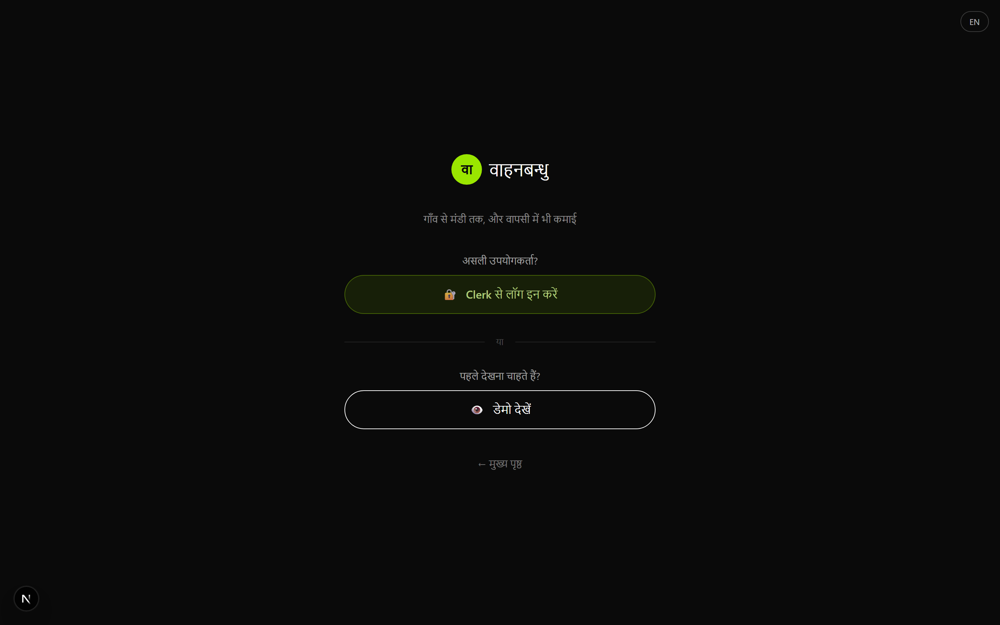
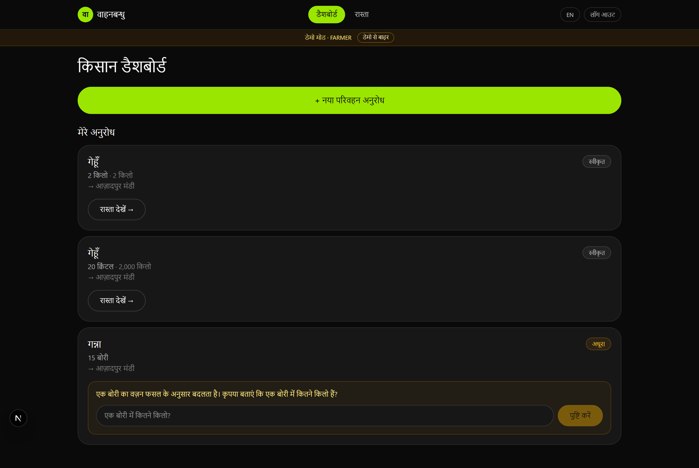
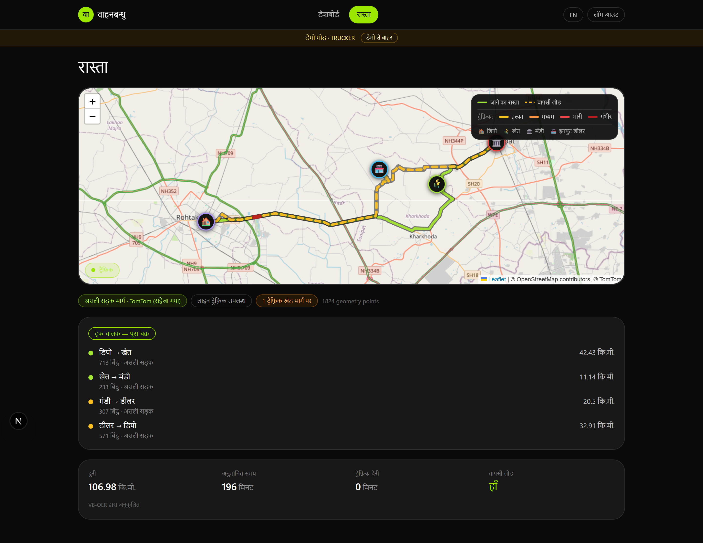
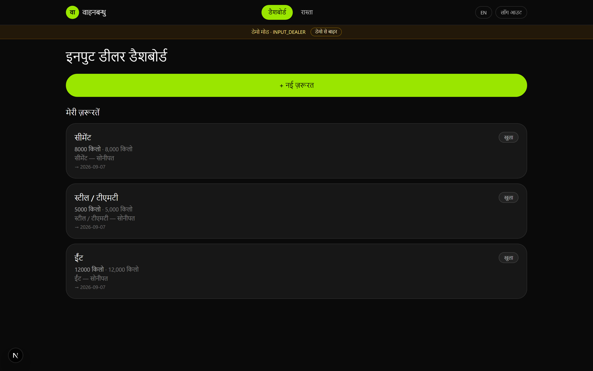

# VahaanBandhu

**Top 10 — Microsoft Azure Agritech Hackathon**

**Rural circular logistics for Indian agriculture — connecting farmers, truck drivers and input dealers so fewer trucks travel empty.**

[Live Demo](https://vahaanbandhu.vercel.app) · [Research Notebooks](research/notebooks) · [Local Setup](#running-locally) · [Tests](#tests)

## Team

| Member | Role |
|---|---|
| Niranjan Praveen | Team Leader, Frontend Developer |
| Debshata Choudhury | QML Developer |
| Vaibhav Jain | Frontend Developer |
| Abhishek Chaubey | Backend Developer |

---

## What is VahaanBandhu?

A farmer in Haryana needs 25 quintals of wheat moved to the Sonipat mandi. A
truck driver takes the load, delivers it — and then drives 40 kilometres home
empty. Meanwhile a building-material dealer along that same road is waiting for
a cement delivery.

Three separate problems, one road.

VahaanBandhu treats them as a single logistics network:

- **Farmers** get affordable transport to the mandi.
- **Truck drivers** find a paying return load instead of running empty.
- **Input dealers** get stock delivered by trucks that were already coming their way.

The economics of rural trucking are dominated by empty running. Turning an empty
return leg into a paid one is the whole idea.

---

## The Three Experiences

These are genuinely different products sharing one platform, not one dashboard
with the job title changed.

### Farmer

Create a transport request: crop, mandi, quantity, pickup point. Designed for a
phone and minimal typing — crop and mandi are pickers, units are tap targets.

**Quantities are handled honestly.** A *bori* (sack) does not have a universal
weight; it varies by crop and packaging. When the system cannot determine the
bag weight, it does **not** assume 50 kg. It records the quantity as unresolved
and asks. A 20-bori paddy load assumed at 50 kg is overstated by 25%, and that
error would propagate straight into vehicle capacity and dispatch the wrong truck.

### Trucker

Vehicle and availability, open jobs, and — most prominently — **return loads**.
Each opportunity shows the empty kilometres it would avoid, the detour it costs,
and the estimated earning. That number decides whether a job is worth taking, so
it gets the visual weight.

### Input Dealer

Material requirements, quantities, delivery windows, and incoming deliveries
from returning trucks. A dealer thinks in stock, not routes, so incoming
deliveries sit above everything else.

---

## How It Works

```
Farmer transport request
        ↓
Resolve crop / mandi / quantity  →  unresolved quantity asks for clarification
        ↓
Candidate trucks and routes
        ↓
Road network + live traffic (TomTom)
        ↓
              VB-QER
        ↓
Outbound route  →  mandi
        ↓
Return-load opportunities near the mandi
        ↓
Final route + empty kilometres avoided
```

---

## VB-QER — VahaanBandhu Quantum-Enhanced Routing Ensemble

VB-QER is the **single routing interface** the application uses. Application
code calls `VBQEROptimizer().solve(instance)` and nothing else — never Dijkstra,
OR-Tools or QAOA directly. Those are components *inside* the ensemble, and
VB-QER decides which ones are appropriate for a given problem.

```
Routing instance
        ↓
Problem classification        shortest path? capacitated? circular return-load?
        ↓
Candidate generation          several classical solvers, deduplicated
        ↓
      VB-QER
        ├── Classical optimization      (2-opt, OR-Tools, local search)
        ├── QUBO / circular return-load selection
        ├── Validated offline quantum signals   (only if they passed validation)
        └── Consensus, diversity and constraint checks
        ↓
Local refinement
        ↓
Incumbent comparison          a worse or infeasible candidate is rejected
        ↓
Final route + explanation
```

Two design rules hold throughout:

**The incumbent guard.** The best valid classical solution is always retained.
An alternative replaces it only if it is feasible *and* better under the same
objective and the same cost snapshot. Any enhancement can add value or add
nothing — it cannot subtract.

**Classification picks the right tool.** Shortest path goes to Dijkstra/A\*,
which are exact in polynomial time; there is nothing for an approximate
optimizer to improve there, so the QUBO layer is not engaged. Return-load
selection is a quadratic knapsack — NP-hard, with a measurably suboptimal greedy
baseline — which is where the optimization research is aimed.

---

## Where Quantum Computing Comes In

**Classical optimization does the work.** Quantum is a research component inside
the ensemble, evaluated offline. The live application never waits for a quantum
computer.

The honest picture:

- **Circular return-load selection can be written as a QUBO.** Choosing which
  return loads to accept, subject to remaining capacity and shared-corridor
  effects between loads, is a quadratic knapsack problem.
- **QAOA was researched offline** against that formulation, on simulators and on
  real hardware.
- **Quantum-derived signals must pass held-out validation** before they may
  influence the ensemble. To date, none has. Distilled route priors were tested
  and **rejected** because they did not generalise to held-out instances — the
  validation gate refused them, which is what it is for.
- **The live request path contains no quantum call.** This is enforced, not
  assumed: a test imports the API in a clean subprocess and asserts no IBM
  module appears, and the backend container does not install the IBM runtime at
  all.

Measured on the return-load benchmark, the largest gain came from the
**formulation**, not from the quantum solver. Framing the problem as a quadratic
knapsack raised the rate of finding the true optimum from 71.7% (greedy) to
98.3% with an exact classical solve. QAOA on the same formulation reached 85.0%,
more slowly.

That is a real and useful result. It is not quantum advantage, and it is not
presented as one.

---

## Real IBM Quantum Validation

A controlled routing experiment — identical QUBO, QAOA depth, optimized
parameters, shot count, decoding and objective — was executed on three 156-qubit
IBM Heron-class systems. Only hardware and transpilation varied.

| Source | Kind | Feasible sampling | Best energy | Decoded path | Found optimum |
|---|---|---|---|---|---|
| Classical exact | ground truth | — | 2.5 | `[0,2,3]` | — |
| Aer simulator | noiseless simulation | 19.82% | 2.5 | `[0,2,3]` | yes |
| **ibm_marrakesh** | **real QPU** | **18.65%** | **2.5** | `[0,2,3]` | **yes** |
| **ibm_fez** | **real QPU** | **16.11%** | **2.5** | `[0,2,3]` | **yes** |
| **ibm_kingston** | **real QPU** | **12.30%** | **2.5** | `[0,2,3]` | **yes** |

All three real QPUs decoded the true optimal path. Hardware noise reduced the
share of feasible samples, but the known optimum remained present in every run.

**This validates the hardware execution and decoding pipeline. It does not
demonstrate quantum computational advantage.** A classical exact solve returns
the same optimum in microseconds. Three devices is also far too small a sample
to rank hardware.

Details: [research/docs/QUANTUM_ROUTE_OPTIMIZATION.md](research/docs/QUANTUM_ROUTE_OPTIMIZATION.md).

---

## Technology

| Layer | Used |
|---|---|
| Frontend | Next.js 15 (App Router), Tailwind v4, Leaflet |
| Backend | FastAPI (Python 3.12) |
| Application data | MongoDB (GeoJSON + 2dsphere, TTL indexes) |
| Cache | Redis — optional by design; an outage degrades to cache misses |
| Authentication | Clerk, plus a restricted development demo mode |
| Roads and traffic | TomTom Routing + Traffic Flow |
| Optimization | VB-QER |
| Research | Python, Jupyter, OR-Tools, Qiskit, IBM Quantum |
| Local orchestration | Docker Compose |

---

## Screenshots

| Sign in — two separate journeys | Farmer dashboard |
|---|---|
|  |  |

| Trucker route — real road geometry and traffic | Input dealer |
|---|---|
|  |  |

The trucker map shows real TomTom carriageway geometry (~1,800 points across the
four legs), congestion segments drawn on the route itself, solid lime for the
outbound leg and dashed amber for the return load.

---

## Running Locally

**Prerequisites:** Docker Desktop (running), Python 3.12, Node.js.

```powershell
# 1. Environment. Nothing is required to start — every integration degrades.
Copy-Item .env.example .env

# 2. Data services
docker compose up -d mongo redis

# 3. Generate the research datasets (first run only, ~5 min)
#    Or run research/notebooks/synthetic_data_generation.ipynb
$env:PYTHONPATH="."
.\.venv\Scripts\python.exe -m vb.pipeline --stage prototype

# 4. Load data into MongoDB
$env:MONGODB_URI="mongodb://localhost:27017"
.\.venv\Scripts\python.exe -m server.app.db.seed --reset

# 5. Backend
$env:REDIS_URL="redis://localhost:6379/0"
.\.venv\Scripts\python.exe -m uvicorn server.app.main:app --host 127.0.0.1 --port 8000

# 6. Frontend (second terminal)
cd client
npm install
$env:NEXT_PUBLIC_API_BASE_URL="http://127.0.0.1:8000"
npm run dev
```

Open <http://localhost:3000>. API docs at <http://127.0.0.1:8000/docs>.

Or run everything in containers:

```powershell
docker compose up --build
```

### Signing in

`/signin` offers two separate journeys:

- **Login with Clerk** — real authentication. Without Clerk credentials
  configured it says so plainly; it does not silently become a demo login.
- **Show Demo** — a role selector for Farmer, Trucker and Input Dealer, using
  seeded local identities. Demo mode is clearly banner-marked and is
  **development-only**: it requires both `DEV_AUTH_ENABLED=true` and a
  non-production environment, enforced server-side.

---

## Research Notebooks

Both notebooks execute top to bottom and generate their own outputs.

**[`synthetic_data_generation.ipynb`](research/notebooks/synthetic_data_generation.ipynb)**
Builds the geospatial dataset for Delhi NCR, Haryana, Punjab and Uttar Pradesh:
administrative geography, mandi reconciliation, crop ontology with Hindi
aliases, privacy-safe farmer nodes, synthetic shops placed on settlement and
road-access patterns, the road graph, and leakage-controlled train/validation/
test splits. Every generator is seeded and reproducible.

**[`route_optimization_classical_quantum.ipynb`](research/notebooks/route_optimization_classical_quantum.ipynb)**
The routing research: classical baselines (Dijkstra, A\*, 2-opt, simulated
annealing, OR-Tools), the multi-objective route score, QUBO construction for
both segment selection and circular return-loads, classical QUBO validation,
QAOA on simulators, real IBM hardware runs, the VB-QER ensemble, and the
ablation that isolates what the quantum component actually contributes.

Supporting write-ups are in [`research/docs/`](research/docs).

---

## Tests

```powershell
$env:PYTHONPATH="."
$env:MONGODB_URI="mongodb://localhost:27017"; $env:REDIS_URL="redis://localhost:6379/0"

.\.venv\Scripts\python.exe -m pytest tests\ -q          # research & routing
.\.venv\Scripts\python.exe -m pytest server\tests\ -q   # application backend
cd client; npm test                                     # frontend
cd client; npm run build                                # production build
```

| Suite | Tests | Needs |
|---|---|---|
| Research & routing | 235 | nothing |
| Application backend | 62 | MongoDB + Redis |
| Frontend | 38 | nothing |
| **Total** | **335** | |

The backend tests run against real MongoDB and Redis rather than mocks: index
behaviour, geospatial queries, status transitions and cache versioning are
exactly what a mock would fake away.

---

## Project Structure

```
client/              Next.js frontend
server/app/          FastAPI backend (routes, services, repositories, schemas)
routing/             VB-QER — ensemble, classical solvers, QUBO/QAOA, providers
vb/                  Shared domain logic: geography, units, crop ontology, QA
research/
  notebooks/         Executable research
  docs/              Methodology, data sources, quantum route optimization
tests/               Research and routing tests
docs/images/         README screenshots
docker/              Container definitions
Data/master/         Reference data (locations, mandis, crops)
Data/demo/           Frozen TomTom demo corridors
Res/                 Benchmarks and quantum research artifacts
```

The synthetic corpus (`Data/synthetic/`) is generated locally rather than
committed — it is large and fully reproducible from the notebook.

---

## Deployment

The frontend deploys to Vercel. The backend needs a Python host plus managed
MongoDB and Redis; Vercel does not provide those.

```powershell
cd client
vercel --prod
```

Then set in the Vercel project: `NEXT_PUBLIC_API_BASE_URL` (the public backend
URL), `NEXT_PUBLIC_CLERK_PUBLISHABLE_KEY` and `CLERK_SECRET_KEY`.

The backend requires a managed MongoDB URI, a managed Redis URL, `TOMTOM_API_KEYS`
and Clerk server credentials. `DEV_AUTH_ENABLED` must be `false` and
`ENVIRONMENT=production`, which disables demo authentication.

---

## Limitations

Stated plainly, because several are easy to overstate.

- **Mandi coordinates are approximate.** Market names come from public sources;
  coordinates are district-level approximations and are flagged as unverified in
  the data, not presented as surveyed positions.
- **Most operational data is synthetic.** Shops, farmer nodes, trucks and
  requests are generated for research. Only the geography and market names are
  drawn from real sources.
- **No quantum advantage is claimed or observed.** See above.
- **Voice input is not implemented.** The API models the fields; no speech
  recognition exists.
- **Real-time GPS tracking is not implemented.**
- **Clerk is implemented but unexercised** — no tenant was available during
  development, so token verification and refresh are untested.
- **Route costs come from a modelled road graph**, not measured fleet telemetry.

---

## License

See [LICENSE](LICENSE) if present in this repository; otherwise all rights are
reserved by the authors.
