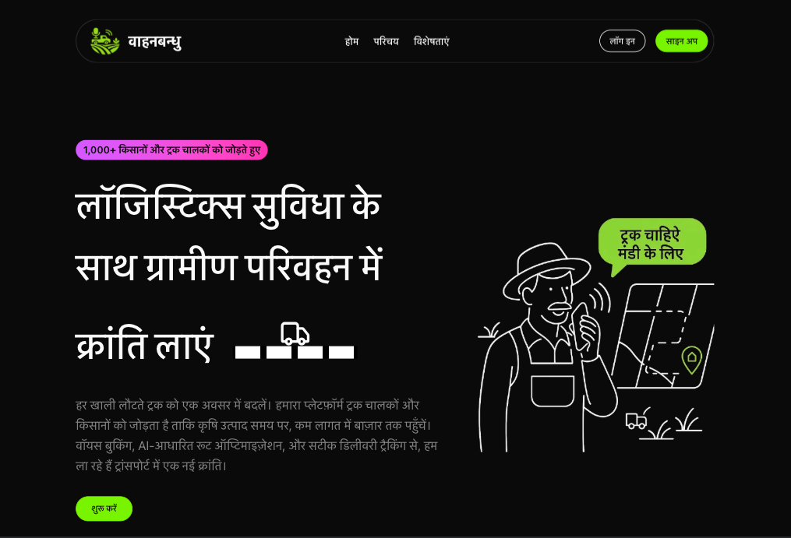

# Hack with Gujarat Challenge 2025

**Team Name** - CODE4CHANGE
**Team Members**:

* Debshata Choudhury
* Niranjan Praveen
* Abhishek Chaubhey
* Vaibhav Jain

**Problem Statement** - Transport & Logistics Optimization for Rural India
**Team Leader Email** - [debshatachoudhury@gmail.com](mailto:debshatachoudhury@gmail.com)

---

## Web App Title:

**VaahanBandhu – Circular Logistics for Driver Welfare & Sustainable Transport**

---

## A Brief of the Prototype:

**Interact with the UI of the website here** – [https://vahaan-bandhu.vercel.app/](https://vahaan-bandhu.vercel.app/)

VaahanBandhu, built by Team CODE4CHANGE, addresses rural India's inefficient agricultural transport network by enabling **circular logistics** for **truck drivers**, while maximizing outcomes for **farmers** and **input dealers**.

Using **Next.js** for the frontend and **Python AI models** in the backend, the app intelligently matches crop loads with available transport, reduces empty return trips, and ensures timely delivery through optimized routing. The system combines **classical AI** and **quantum computing techniques** to make route selection smarter and faster, while remaining affordable and scalable for rural communities.

---




## Key Features Include:

* **AI-Powered Route Optimization** – Smart algorithms reduce travel time and fuel usage.
* **Quantum-Enhanced Pathfinding** – Quantum logic processes multiple routes simultaneously to find optimal logistics paths.
* **Real-Time Tracking** – Users receive live updates via GPS-based tracking systems.
* **Demand Forecasting** – AI models predict future transport needs based on usage data.
* **Farmer-Truck Coordination** – Matches supply with transport capacity through a smart interface.
* **Circular Logistics** – Promotes a profit-sharing return-trip model to maximize vehicle usage.
* **Multi-User Roles**:

  * **Farmers** – Post crop delivery requests.
  * **Truck Drivers** – Find loads and optimize round trips.
  * **Input Dealers** – Manage agri-input transportation.

---

## Quantum Computing Integration (Simplified Overview)

Here are the key quantum computing concepts used in the code:

### Qubit Encoding

* Traffic is encoded as qubits: `|0⟩ = bad`, `|1⟩ = good`.
* `qc.x(i)` flips qubits based on traffic score (e.g., >70% = good traffic).

### Quantum Entanglement

* `qc.cx(i, i+1)` gates create correlation between road segments.
* Helps evaluate connected routes as a unit (if one is bad, others likely are too).

### Measurement & Probabilistic Output

* `qc.measure_all()` collapses qubits into classical bits.
* The most frequent outcome (`max(counts)`) suggests the best path.

### Quantum Parallelism

* Evaluates **2ⁿ** routes at once using quantum superposition.

### Hybrid Approach

* Classical logic handles UI, maps, and API integrations.
* Quantum logic optimizes critical route segments (up to 5-qubit simulations).
* Results are visualized using **Folium** for map rendering.

This hybrid quantum-classical design demonstrates how **emerging quantum tech** can solve real-world challenges in logistics — even within today's hardware limits.

---

## Technology Stack:

* **Frontend**: Next.js (React Framework)
* **Backend**: Python (FastAPI or Flask), AI Models (Scikit-learn, TensorFlow), Quantum Logic (Qiskit)
* **Database**: PrismaDB /Supabase/ PostgreSQL
* **Real-Time Updates**: WebSockets, GPS APIs, TomTom API
* **Deployment**: Vercel (Frontend), Render (Backend)

---

## Code Execution Instructions:

### 1. Clone the Repository

```bash
git clone https://github.com/Niranjan1Praveen/VahaanBandhu.git  
cd vaahanbandhu
```

---

### 2. Install Frontend Dependencies (Next.js)

```bash
cd client
npm install
```

---

### 3. Install Backend Dependencies (Python API)

```bash
cd ../server/truckroutenavigator
pip install -r requirements.txt
```

---

### 4. Start the Application

#### Start Frontend (Next.js):

```bash
cd ../../client
npm run dev
```

#### Start Backend (Python):

```bash
cd ../server/truckroutenavigator
python app.py
```

---

### 5. Access the Application

Visit `http://localhost:3000` in your browser to start using the platform.

---

## Scalability, Sustainability, and Affordability Plan:

* **Farmer Reach**: Onboarding via FPOs, agri-input dealers, and regional agents.
* **Scalability**: Modular backend allows rollout to new geographies and logistics clusters.
* **Sustainability**: Revenue model from commercial transporters and analytics services.
* **Affordability**: Core services are free for farmers; subsidized via B2B partnerships.

---

## Summary

VaahanBandhu sets a new standard for rural transportation optimization. By combining AI, quantum computing, and user-centric design, it makes logistics **faster, fairer, and more efficient** — empowering farmers and truckers alike.

---
